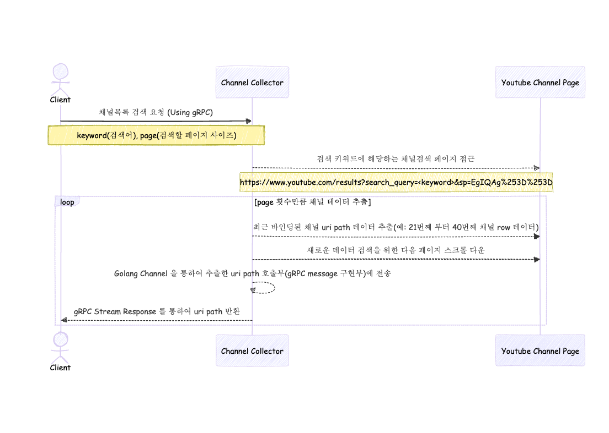

# Channel Page Collector

유튜브 채널 목록 페이지를 스크래핑하여 키워드별로 채널에 접근할 수 있는 **subscriber name(ex. @mango1135)** 을 추출합니다.<br/>
페이지 접근 후 스크롤 다운하여 새로운 데이터를 계속 반환받을 수 있으며, **gRPC stream response** 기능을 이용하여 스크롤 다운 할 때 마다 바인딩되는 채널 subscriber name 목록을 클라이언트가 값을 반환받을 수 있습니다. <br/>

만약 "economics" 키워드로 채널 데이터들을 수집하려 한다면 아래와 같은 URL에 접근하게 됩니다.<br/>
https://www.youtube.com/results?search_query=economics&sp=EgIQAg%253D%253D


## Flow
해당 서비스는 아래와 같은 흐름으로 유튜브 채널 검색을 통하여 데이터를 추출하고 Client 에 gRPC response stream 을 활용하여 추출되는 데이터를 추출 당시에 바로 중간중간 반환합니다.


- **Client** - gRPC Client
- **Channel Collector** - 해당 서비스
- **Youtube Channel Page** - 유튜브 웹사이트

**아래와 같은 요청량 제어 정책을 두어 IP Block 에 대비하고 있습니다.**
- 웹페이지 접근 및 스크롤 다운 등 유튜브 웹사이트에 대한 호출량을 초당 1번으로 제한
- Client 로 부터 동시에 여러 요청이 발생할 경우를 대비하여 웹페이지 접근 및 스크롤 다운에 대한 mutex lock 제어를 활용하여 동시요청 상황에서도 초당 요청조건 제어

## gRPC
- [Proto 호출 명세](https://github.com/Sujin1135/channel-page-collector-interface/blob/main/protobuf/channel_page.proto)

## Requirements
|    | Main version  |
|----|---------------|
| Go | 1.24+         |

## Run

**Execute**
```bash
## build
go build -o channel-page-collector cmd/main.go

## execute
./channel-page-collector
```

**Generate pb.go files from protobuf**
```bash
protoc \
  --proto_path=api/grpc/interface/channel-page-collector-interface/protobuf \
  --go_out=paths=source_relative:api/grpc/interface/channel-page-collector-interface/protobuf \
  --go-grpc_out=paths=source_relative:api/grpc/interface/channel-page-collector-interface/protobuf \
  api/grpc/interface/channel-page-collector-interface/protobuf/*.proto
```
